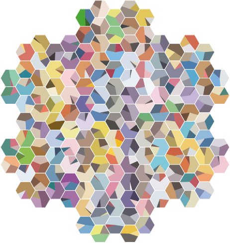

# Pokémon Colors
This script produces an SVG graphic of hexagonal grid of pie charts representing the relative proportion of the dominant colors of the original 151 Pokémon as computed by applying _k_-means clustering to the official Sugimori art after some pre-processing to remove transparent and dark colors.



## Images
This script expects the extracted images, numbered `1.png`, `2.png`, etc. from the [Sugimori art (404MB)](https://veekun.com/static/pokedex/downloads/pokemon-sugimori.tar.gz) found on the [veekun Pokédex](https://veekun.com/dex/downloads) to be in `pokemon/sugimori/`.

## Setup
This script uses Python 3.10.16 and the packages listed in `requirements.txt`.

Here is a sample installation using Anaconda as the environment and package manager.

```
conda create -n pokemon
conda activate pokemon
conda install --file requirements.txt
```

## Usage
The basic usage is simply `python3 colorhex.py`, which prints some logging information and produces a file named `pokemon.svg`.

Linking every parameter to command-line arguments was outside of the scope of this project, but parameters can be modified in the main section of the script.

Parameters that can be modified (mostly commented out) include:
* `indices` (default `(1,151)`): the image numbers to process. Up to 151 indices can be specified with the default hexagon layout, but `getCenters()` can be overridden in a derived class to produce some other layout with more or fewer indices
* `radius` (default `20`): the scale of the hexagons and therefore also their positions
* `imageScaling` (default `25`): the scale of boxes for the rectangular grid and weighted grid when running `showGrid()` and `showWeightedGrid()`
* `nclusters` (default `3`): the number of clusters for _k_-means, corresponding to the number of dominant colors computed. This implementation uses the same number of clusters for every image; results are generally aesthetically pleasing for 3 colors, but there is potential to pre-analyze every image to determine the optimal number of clusters for every image
* `lumi_cutoff` (default `0.2`): the brightness threshold (see _Technical Details_) below which the pixels are not included in the dataset, removing dark colors which aren't as aesthetically pleasing when computed and represented
* `alpha_cutoff` (default `200`): the RGBA alpha threshold below which the pixels are not included in the dataset
* `testmode` (default `False`): whether to skip the computationally intensive image processing and visualize the hexagon graphic with dummy data
* `rotStart` (default `RotationStart.RANDOM`): how to choose the starting angle for the pie chart; `RotationStart.ZERO` starts every pie chart at 0º, `RotationStart.INDEX` starts each pie chart at an angle equal to the image index
* `width`, `height` (default `480`, `550`): width and height of the SVG graphic
* `bounding_box` (default `False`): whether to draw the SVG graphic bounding box, useful for development
* `draw_coords` (default `False`): whether to draw the hexagonal coordinate system coordinates onto each hexagon, useful for development
* `fname` (default `test.svg`): filename of the output SVG file

Classes are written to be as general as possible so that the code is reusable; as such, it may be useful to run the script in interactive mode (`python3 -i colorhex.py`) to generate new SVG files without recomputing, or to import the script as a module so that the classes can be derived or used in other applications.

## Technical Details

Some additional technical details:
* [Pillow](https://pillow.readthedocs.io/en/stable/) is used to load images and produce the grid and weighted grid images
* The Sugimori images have RGBA alpha values, but they are not all 0 or 255, so a soft cutoff of 200 is used instead after analyzing the histogram of alpha values
* The Sugimori images have many variants, but they are not used in this analysis; only the basic images of format `25.png` are used
* Brightness is computed from RGB using [Adobe RGB luma](https://en.wikipedia.org/wiki/HSL_and_HSV#Lightness); dominant colors with low brightness don't result in an aesthetically pleasing image, possibly because dark colors from outlines and shadows don't register as dominant colors to the human eye
* RGB is converted to [CIE LAB](https://en.wikipedia.org/wiki/CIELAB_color_space), a perceptually uniform color space, such that Euclidean distance -- the metric used by _k_-means -- corresponds to perceptual color difference. This idea was sourced from [here](https://hackernoon.com/extract-prominent-colors-from-an-image-using-machine-learning-vy2w33rx). Some commented code can be found in the script where this step was skipped and _k_-means was applied directly to RGB, and while the pure RGB result is often fine, the results really, truly are better when using CIE LAB. This step was performed using the `color` module of `sklearn.image`
* To compute dominant colors, _k_-means clustering was performed with 3 clusters and the default `sklearn.cluster` implementation and parameters, and the cluster centers were taken as the dominant colors. Other cluster amounts are possible, but the results seem to be most aesthetically pleasing overall with just 3. The image processing is done in parallel with multithreading
* [`svg.py`](https://github.com/orsinium-labs/svg.py) is used to create the SVG. The geometry used here is detailed and tedious, but here are a few notes.
  * Hexagons can be created with polygons, and are used both for outlines and as clipping paths
  * Hexagon geometry to create a "coordinate system", compute centers and vertices, etc. is present throughout
  * The "pie chart sectors" were not created with circles, but rather with polygons with the understanding that hexagons would clip excess away
  * The exact polygon required depends on the angle, since simple triangles will not cover the appropriate circular sector
  * Clip paths are applied before SVG rotation transforms, so the polygon needs to be rotated manually using a rotation matrix so the clip path applies properly
  * The starting angle of the _first_ sector can be freely chosen; the choice here is random, but the code provides some options to control this
  * The most manual part of the process was defining a pattern for 151 hexagons that still looked nice; details are in the comments
